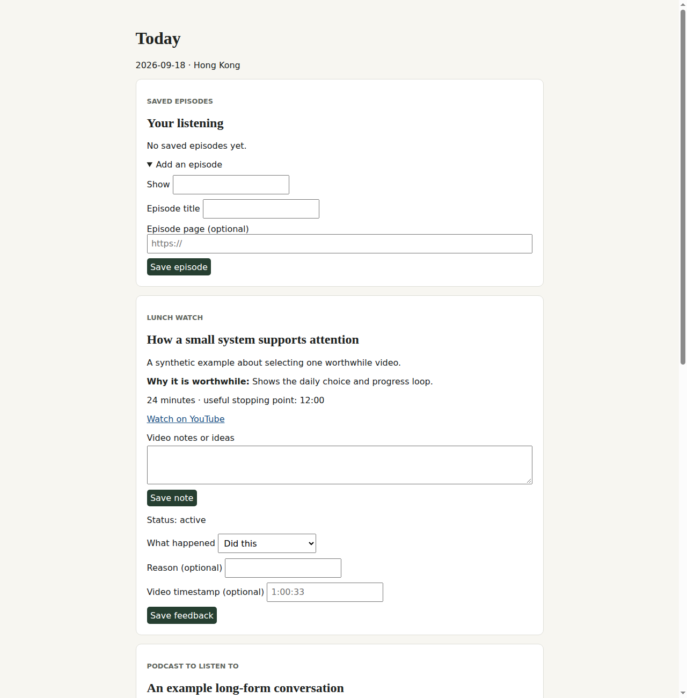

# Information Diet

Information Diet is a local daily media planner. It turns your saved videos, articles, and podcast episodes into a short list: one video, one optional read, and one podcast. The browser page is the human daily surface for feedback, notes, listening progress, saved episodes, and book pages.



The app does not collect content or contact external services. You provide a local catalog of links you have already chosen. SQLite keeps the list and your progress through browser restarts.

## Set up once

You need Python 3.11 or later.

```sh
git clone https://github.com/kn0wsnothing/information-diet-showcase.git information-diet
cd information-diet
python3 -m venv .venv
.venv/bin/pip install .
.venv/bin/information-diet init
```

`init` writes an empty catalog to `~/.local/share/information-diet/catalog.json`. The database is `~/.local/share/information-diet/information-diet.sqlite3`. Set `INFORMATION_DIET_DATA_DIR` before setup to use another directory. The catalog template is empty by design.

## Work with an assistant

Use a coding assistant with local terminal and filesystem access, such as Codex or Claude Code. Give it this repository and [AGENT_GUIDE.md](AGENT_GUIDE.md); a chat only assistant cannot run this local app or inspect your catalog.

Paste this prompt to set it up:

> Clone https://github.com/kn0wsnothing/information-diet-showcase.git, install it in an isolated Python environment, initialize Information Diet, and read `AGENT_GUIDE.md`. Do not add catalog entries yet. Tell me where the local catalog and database are stored.

Paste this prompt after installation:

> Read `AGENT_GUIDE.md` in my Information Diet checkout. Help me turn my saved links into a valid local catalog. Do not browse, fetch, or invent media. Show me the proposed catalog before writing it, then validate and prepare today’s list when I approve it.

Your catalog, notes, and local database may be sent to whichever AI provider you choose if your assistant reads them. Review that provider’s data policy before granting file access. Information Diet itself has no AI integration, account, or publishing feature.

## What happens each day

After a prepared list, open `http://127.0.0.1:8422`. Record whether an item was completed, should continue, was not started, or is not interesting. A completed item does not return. A not started item is reconsidered only after an explicit refresh. The local server has no authentication and binds to loopback by default.

The public app includes real FastAPI routing, SQLite state, catalog validation, selection, feedback, media notes, saved episodes, and book progress. It does not include automatic importing, source connectors, hosted accounts, backups, or remote service integrations.

## License

MIT Copyright 2026 John. See [LICENSE](LICENSE) and [CONTRIBUTING.md](CONTRIBUTING.md).
